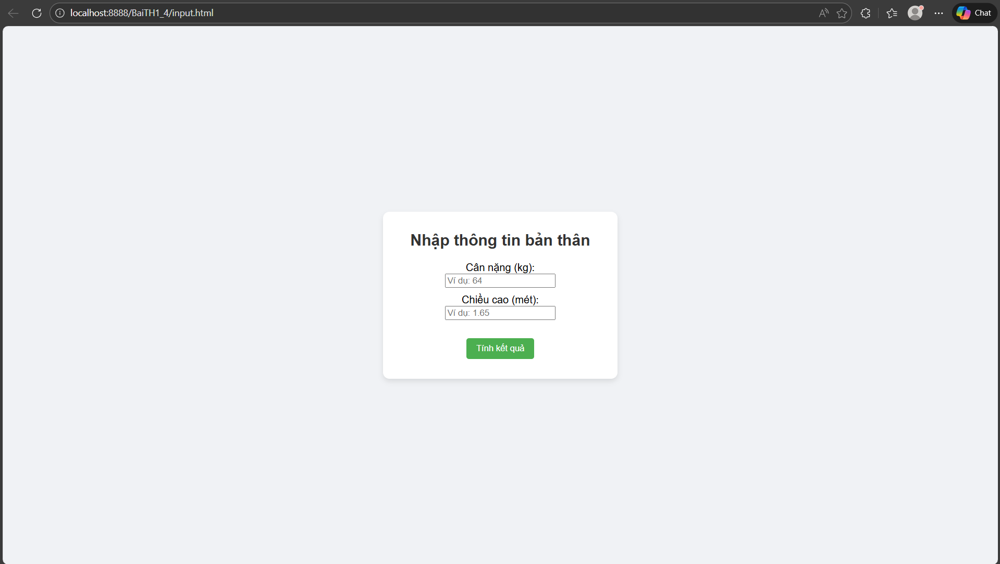
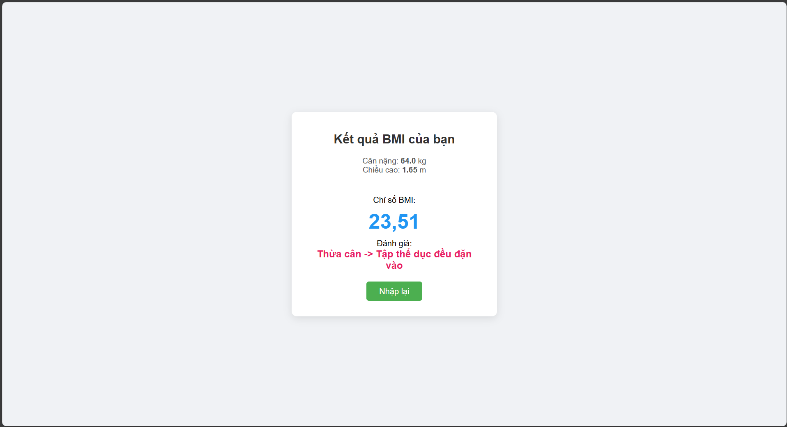
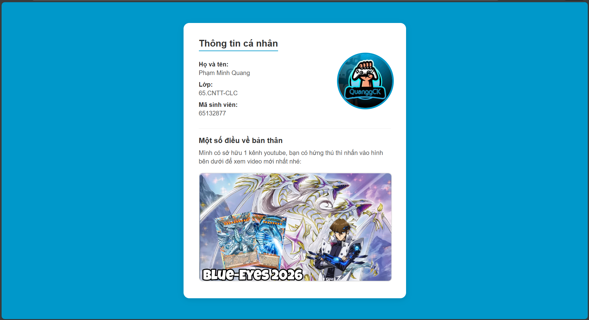
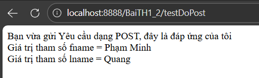
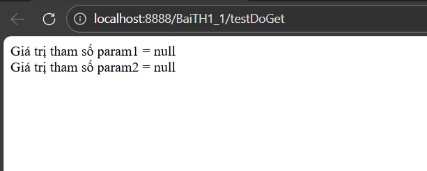
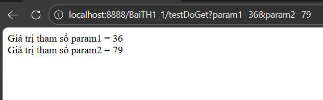

# 🌐 65132877_Web2Spring
📂 This is the repository for storing **Web2** work on class and assignment.

---

## ⚙️ Requirement
- ☕ **Programming Language**: Java  
- 🐱 **Web Server**: Tomcat 10.1  
- 💻 **IDE**: Eclipse IDE  
- 🔧 **JDK Version**: 11  

---

## [🧮 BaiTH1_4 – BMI Calculator](BaiTH1_4/)
📌 This assignment helps me calculate **BMI** and display the result.

| 📝 Input | 📊 Result |
|-------------|-------------|
|  |  |

---

## [👤 BaiTH1_3 – About Me](BaiTH1_3/)
🧑‍💻 A short introduction about myself.

| 📸 Result | 
|-------------|
|  | 

---

## [📬 BaiTH1_2 – ViDuDoPost](BaiTH1_2/)
📤 This task helps me understand how **doPost** works in Servlet.

| 📝 Input | 📊 Result |
|-------------|-------------|
|  |  |

---

## [🔗 BaiTH1_1 – ViDuDoGet](BaiTH1_1/)
📥 This task helps me understand how **doGet** works.

### 🔍 Example
If you want to change parameters in the URL:
Syntax: http://localhost:8888/BaiTH1_1/testDoGet?param1=36&param2=79  
?param1=36&param2=79: Change the first param to 36 and the second param to 79  
Let me show you
| Before | After |
|-------------|-------------|
|  |  |

---

## [ViDuHello](ViDuHello/)
This asignment is to help use to get used to with the layout of Eclipse

