# 🌐 65132877_Web2Spring
📂 This is the repository for storing **Web2** work on class and assignment.

---

## ⚙️ Requirement
- ☕ **Programming Language**: Java  
- 🐱 **Web Server**: Tomcat 10.1  
- 💻 **IDE**: Eclipse IDE  
- 🔧 **JDK Version**: 11  

---

## [🔹 B2_TruyenDuLieuSangView](B2_TruyenDuLieuSangView/)
## [🔹 B3_LayThamSoTaiController](B2_LayThamSoTaiController/)
## [🔹 B4_BMICalculator](B4_BMICalculator/)
## [🔹 B5_TruyenDoiTuong2View](B2_TruyenDoiTuong2View/)
## [🔹 B6_TruyenDanhSach2View](B6_TruyenDanhSach2View/)
These 5 assignments are to understand

---

## [🎯 MiniProject](MiniProject/)
What is this project about? -> Some of my favourite video on youtube and a mini quiz with my CV.  
This mini project to help me practice all the things I've learnt for Java Web (HTML, JSP, even Json).  
I use json to store the question.

| 🔐 Login | 🏠 HomePage | ❓ Question |🏆 Result
|-------------|-------------|-------------|-------------|
| 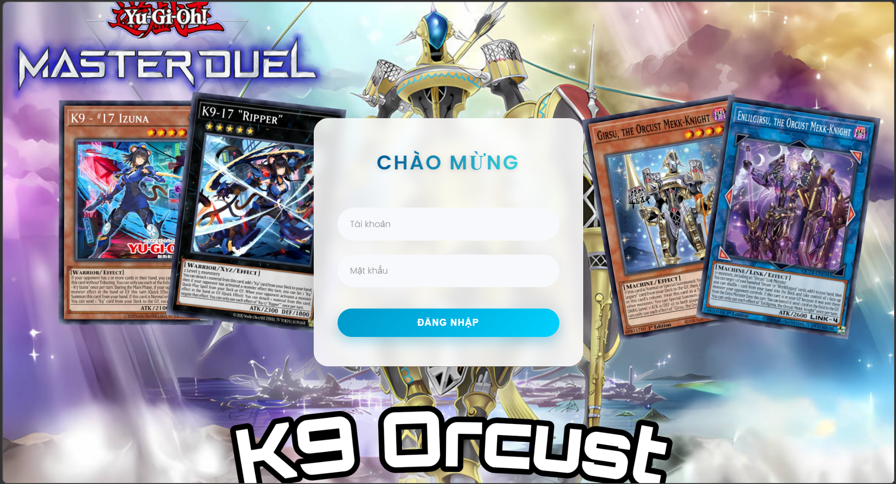 | 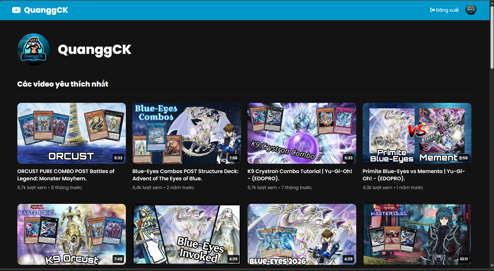 | 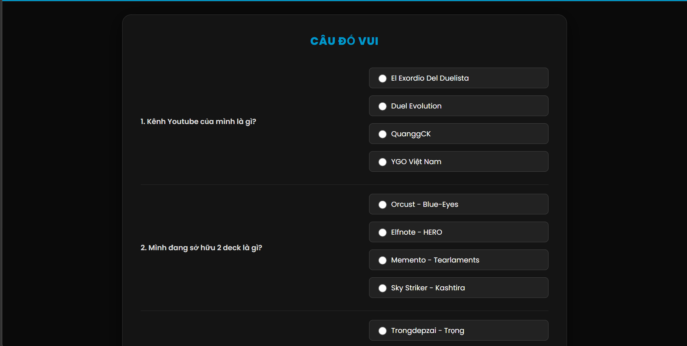 | 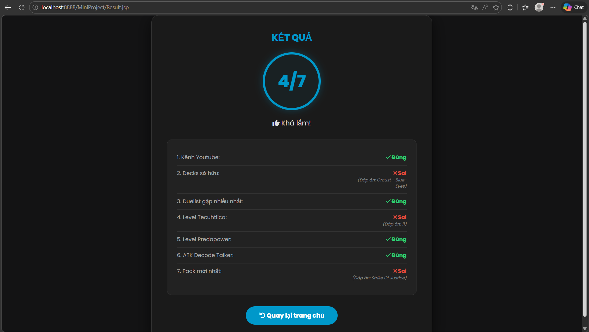 |

---

## [🔑 LoginHTML&JSP](LoginHTML_JSP)
This assignment teaches me how **html** and **jsp** works.  
HTML: Is a **static** web. It just create the exact what we did in the code, only html.  
JSP: Is a **dynamic** web. It can mix with both Java and HTML.

---

## [🧮 ViDuTinhTong](ViDuTinhTong/)
This assignment helps me to understand how to use method **POST** and **GET** when displaying the result.  
POST will hide the data on the url of the webiste whereas GET will show it.

| 📝 Input | 📊 Result |
|-------------|-------------|
| 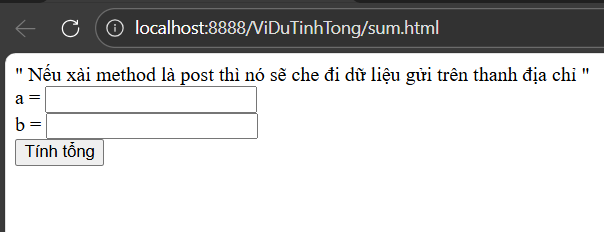 | 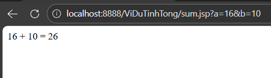 |

---

## [🧮 BaiTH1_4 – BMI Calculator](BaiTH1_4/)
📌 This assignment helps me calculate **BMI** and display the result.

| 📝 Input | 📊 Result |
|-------------|-------------|
| 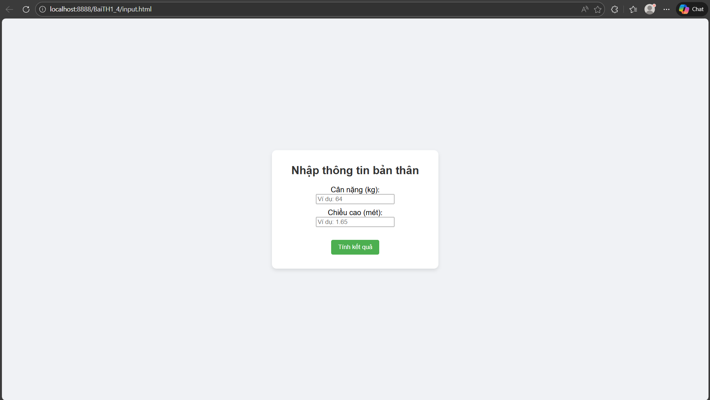 | 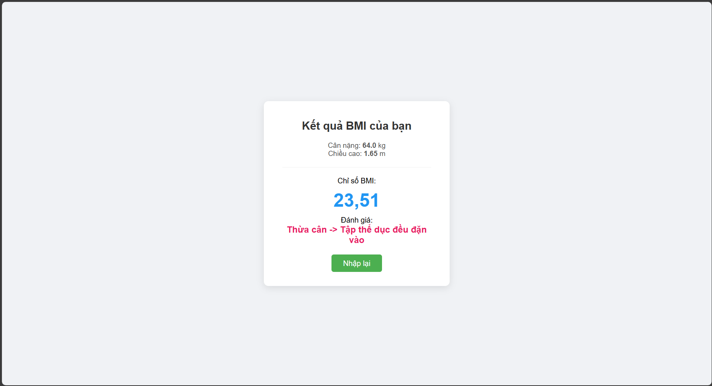 |

---

## [👤 BaiTH1_3 – About Me](BaiTH1_3/)
🧑‍💻 A short introduction about myself.

| 📸 Result | 
|-------------|
| 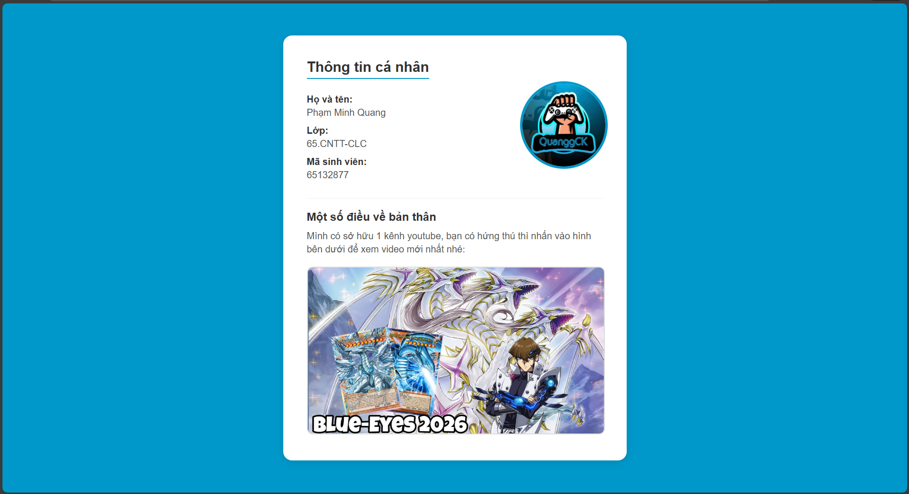 | 

---

## [📬 BaiTH1_2 – ViDuDoPost](BaiTH1_2/)
📤 This task helps me understand how **doPost** works in Servlet.

| 📝 Input | 📊 Result |
|-------------|-------------|
|  | 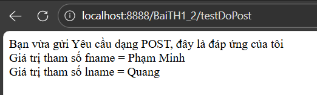 |

---

## [🔗 BaiTH1_1 – ViDuDoGet](BaiTH1_1/)
📥 This task helps me understand how **doGet** works.

### 🔍 Example
If you want to change parameters in the URL:
Syntax: http://localhost:8888/BaiTH1_1/testDoGet?param1=36&param2=79  
?param1=36&param2=79: Change the first param to 36 and the second param to 79  
Let me show you
| Before | After |
|-------------|-------------|
| 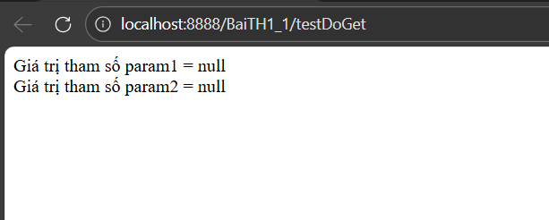 | 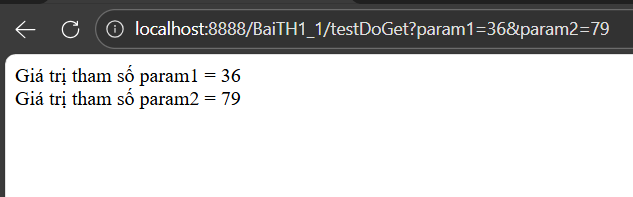 |

---

## [ViDuHello](ViDuHello/)
This asignment is to help use to get used to with the layout of Eclipse

